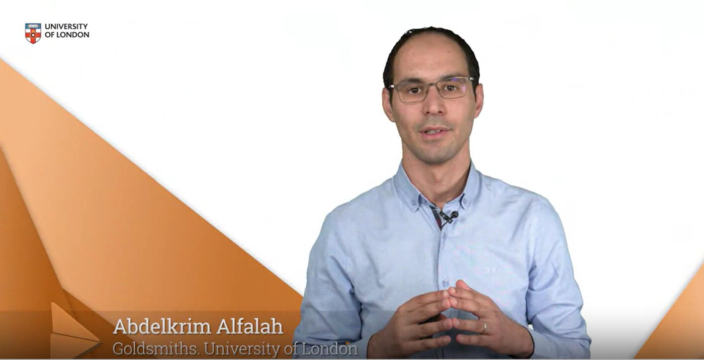

import Link from '@docusaurus/Link';
import styles from '/src/pages/index.module.css';

Co-built this course on Discrete mathematics during my PhD studies @t Goldsmiths University of London.
This course is taught as part of BSc Computer Science. A great opportunity to learn Sets, combinatorics, functions, and graph theory.

          <Link
            className="button button--primary button--lg"
            to="https://www.london.ac.uk/study/courses/undergraduate/bsc-computer-science/">
            Dive Deeper >>
          </Link>

